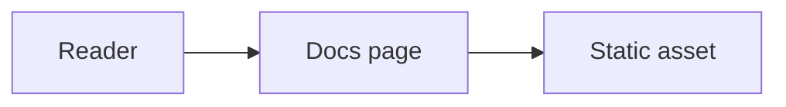

# Diagram and Image Style Guide

Use this guide when you add or update diagrams, illustrations, and images in the Nextellar docs.
It keeps visuals consistent with the site theme, readable in light and dark mode, and easy to maintain in the repository.

## Color palette

Diagrams and images should use the same neutral base as the docs UI defined in `src/app/globals.css`.

### Core colors

| Role          | Light theme               | Dark theme                | Usage                        |
| ------------- | ------------------------- | ------------------------- | ---------------------------- |
| Background    | `#FFFFFF`                 | `#000000`                 | Canvas and page fills        |
| Foreground    | `#000000`                 | `#FFFFFF`                 | Text, strokes, icons         |
| Muted surface | `#F5F5F5` (`--secondary`) | `#141414` (`--secondary`) | Secondary nodes, panels      |
| Border        | `#000000` at 40% opacity  | `#FFFFFF` at 20% opacity  | Boxes and dividers           |
| Accent        | `#533483`                 | `#533483`                 | Highlights, diagram emphasis |
| Success       | `#22C55E`                 | `#16A34A`                 | Positive states only         |
| Warning       | `#EAB308`                 | `#CA8A04`                 | Caution callouts only        |
| Error         | `#EF4444`                 | `#DC2626`                 | Failure paths only           |

Reserve semantic greens, yellows, and reds for status meaning.
Do not use them as decorative fills on neutral architecture diagrams.

### Mermaid diagrams

Mermaid blocks render through `src/components/Mermaid.tsx` with a fixed dark theme.
Use the built-in palette instead of custom hex values in diagram source when possible:

| Token                | Hex       | Usage                  |
| -------------------- | --------- | ---------------------- |
| `primaryColor`       | `#1a1a2e` | Node backgrounds       |
| `primaryBorderColor` | `#533483` | Node borders           |
| `lineColor`          | `#e94560` | Connectors (sparingly) |
| `secondaryColor`     | `#16213e` | Group backgrounds      |
| `titleColor`         | `#ffffff` | Titles on dark canvas  |

Embed Mermaid in MDX with a fenced `mermaid` code block:



### Example palette asset


## Sizing

### Diagrams and illustrations

| Asset type                | Recommended size          | Notes                                            |
| ------------------------- | ------------------------- | ------------------------------------------------ |
| Inline SVG                | `viewBox` up to `800×400` | Scales with prose width; prefer SVG for diagrams |
| Wide architecture diagram | Max width `720px`         | Wider diagrams scroll on mobile                  |
| Mermaid flowchart         | ≤ 6 nodes per row         | Split large flows into multiple diagrams         |
| Labeled frame             | `480×280` to `640×360`    | Leave 24px padding inside the frame              |

Set `width` and `height` on SVG exports only when the authoring tool requires them.
Prefer a responsive `viewBox` so images scale in the docs layout.

### Screenshots

Component screenshots follow the [Screenshot Workflow](/docs/guides/screenshot-workflow):

- Viewport: `1280 × 800 px` before crop
- Format: PNG, lossless
- Path: `public/screenshots/<component-slug>/<variant>.png`

For retina clarity, export at 2× density only when the cropped region stays under `1440px` wide.

### Inline images in MDX

```mdx

```

Paths are relative to `public/`.
Do not commit images wider than `1600px` unless they are full-page references.

## Labeling

### Text in diagrams

- Use **sentence case** for node labels (`Wallet provider`, not `Wallet Provider`).
- Use **monospace** for code identifiers (`useStellarWallet`, file paths, CLI flags).
- Keep labels under **24 characters** when possible; wrap long names on a second line inside the node.
- Number callout steps (`1`, `2`, `3`) only when the prose references them.

### Captions and alt text

Every image must include alt text that describes the content, not the file name.

```mdx

```

Optional captions use italic text on the line below the image:

```mdx


_Figure 1. Provider wraps hooks at the app root._
```

### Example assets

| File                                                                         | Purpose                       |
| ---------------------------------------------------------------------------- | ----------------------------- |
| [`color-palette.svg`](/images/style-guide/color-palette.svg)                 | Approved swatches             |
| [`flowchart-example.svg`](/images/style-guide/flowchart-example.svg)         | Simple left-to-right flow     |
| [`labeled-frame-example.svg`](/images/style-guide/labeled-frame-example.svg) | Numbered callouts and caption |


## Export settings

### SVG (Figma, Illustrator, Inkscape)

| Setting           | Value                                          |
| ----------------- | ---------------------------------------------- |
| Format            | SVG 1.1                                        |
| Outline text      | Yes (convert to paths if fonts may differ)     |
| Decimal precision | 2                                              |
| Embed images      | No (link or flatten separately)                |
| Background        | Transparent or `#FFFFFF` for light-only assets |

Run [SVGO](https://github.com/svg/svgo) or your editor's "Optimize SVG" before commit when file size exceeds `20 KB`.

### PNG (screenshots, raster diagrams)

| Setting     | Value                             |
| ----------- | --------------------------------- |
| Color space | sRGB                              |
| Bit depth   | 24-bit (no alpha unless needed)   |
| Compression | Lossless PNG                      |
| Scale       | 1× default; 2× for small UI crops |

### Mermaid (source in MDX)

| Setting           | Value                                                            |
| ----------------- | ---------------------------------------------------------------- |
| Direction         | `LR` for flows, `TD` for hierarchies                             |
| Labels            | Plain text; avoid HTML in node text                              |
| Export (optional) | [Mermaid Live Editor](https://mermaid.live) → SVG, then optimize |

Do not commit rendered Mermaid PNGs when the source block is sufficient.
The site renders Mermaid at build/runtime in the browser.

### Dark mode assets

When an image cannot use theme tokens (for example, a branded illustration), provide paired assets:

```mdx


```

See [Theming and Dark Mode](/docs/theme) for token-based styling.

## Checklist before opening a PR

1. Colors match the palette above or the Mermaid defaults in `Mermaid.tsx`.
2. SVGs include a `<title>` or descriptive `aria-labelledby` for accessibility.
3. Alt text is present and describes the diagram.
4. Files live under `public/images/` or `public/screenshots/` with kebab-case names.
5. `pnpm build:content` completes without errors.

## Related

- [Screenshot Workflow](/docs/guides/screenshot-workflow)
- [Theming and Dark Mode](/docs/theme)
- [Contributing to Documentation](/docs/guides/contributing)
- [Add a New Docs Page](/docs/guides/add-docs-page)
