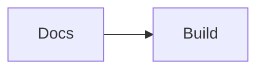

# MDX Custom Components Reference

MDX pages can use the components registered in `src/components/mdx-components.tsx` without local imports. Use this page as the single reference for component names, props, examples, and constraints.

## General Rules

| Component                                              | Purpose                                    |
| ------------------------------------------------------ | ------------------------------------------ |
| `Note`                                                 | Callout box for tips, warnings, and info   |
| `Tabs`, `TabsList`, `Tab`, `TabsContent`               | Tabbed content panels                      |
| `Steps`, `Step`, `StepTitle`, `StepContent`            | Numbered step sequences                    |
| `FolderTree`, `Folder`, `File`                         | Visual directory trees                     |
| `Button`                                               | Styled action button                       |
| `Mermaid`                                              | Render Mermaid diagrams                    |
| `CodeTabs`                                             | Syntax-highlighted code with language tabs |
| `Dialog`, `DialogTrigger`, `DialogContent`             | Modal dialog                               |
| `Popover`, `PopoverTrigger`, `PopoverContent`          | Floating popover                           |
| `Select`, `SelectContent`, `SelectItem`, `SelectValue` | Dropdown select                            |
| `Checkbox`, `Label`, `Input`                           | Form controls                              |
| `Menu`, `MenuItem`, `MenuTrigger`, `PopMenu`           | Dropdown menu                              |

## Content Components

| Component                 | Props                                                                                                               | Constraints                                                                                   |
| ------------------------- | ------------------------------------------------------------------------------------------------------------------- | --------------------------------------------------------------------------------------------- |
| `Note`                    | `type?: "none" \| "info" \| "warning" \| "alert" \| "success" \| "tip"`, `hideIcon?: boolean`, standard `div` props | Use for short callouts, not long sections.                                                    |
| `Preview`                 | Standard `div` props                                                                                                | Designed for framed component previews. Keep one focused example inside it.                   |
| `SearchButton`            | `placeholder?: string`, `size?: "xs" \| "sm" \| "md" \| "lg" \| "xl"`, standard `button` props                      | Opens nothing by itself in MDX examples unless you wire an event handler.                     |
| `Mermaid`                 | `chart: string`                                                                                                     | Prefer fenced `mermaid` blocks for readable source. Invalid diagrams render an error message. |
| `CodeTabs`                | `tabs: Record<string, { syntax: string; language: string }>`                                                        | Each tab needs a stable key and syntax string.                                                |
| `CustomSyntaxHighlighter` | `tabs`, `className?`, `themeMode?: "light" \| "dark"`, `lightTheme?`, `darkTheme?`, `indicatorColor?`               | Use `CodeTabs` unless you need theme or indicator options.                                    |

```mdx
<Note>Run `pnpm build:content` after adding any new MDX file.</Note>
```

<Preview>
  <SearchButton placeholder="Search docs" size="md" />
</Preview>

<Note>Run `pnpm build:content` after adding any new MDX file.</Note>

## Tabs

| Component     | Props                                            | Constraints                                                      |
| ------------- | ------------------------------------------------ | ---------------------------------------------------------------- |
| `Tabs`        | `defaultValue: string`, `children`, `className?` | `defaultValue` must match one `Tab` and one `TabsContent` value. |
| `TabsList`    | `children`, `className?`                         | Place `Tab` children inside it.                                  |
| `Tab`         | `value: string`, `children`, `className?`        | Must be rendered inside `Tabs`.                                  |
| `TabsContent` | `value: string`, `children`, `className?`        | Must be rendered inside `Tabs`. Hidden content is not mounted.   |

````mdx
<Tabs defaultValue="npm">
  <TabsList>
    <Tab value="testnet">Testnet</Tab>
    <Tab value="mainnet">Mainnet</Tab>
  </TabsList>
  <TabsContent value="npm">```bash npm install ```</TabsContent>
  <TabsContent value="pnpm">```bash pnpm install ```</TabsContent>
</Tabs>
````

## Steps

| Component     | Props                                                                                                                              | Constraints                                                   |
| ------------- | ---------------------------------------------------------------------------------------------------------------------------------- | ------------------------------------------------------------- |
| `Steps`       | Standard `div` props                                                                                                               | Only valid `Step` children receive automatic numbering.       |
| `Step`        | `contentPosition?: "right" \| "below"`, `className?`, `titleClassName?`, `contentClassName?`, `lineClassName?`, `numberClassName?` | Use with `StepTitle` and `StepContent`.                       |
| `StepTitle`   | Standard `div` props                                                                                                               | Must be a child of `Step` to appear in the expected position. |
| `StepContent` | Standard `div` props                                                                                                               | Must be a child of `Step` to appear in the expected position. |
| `Stepper`     | `steps: { title: ReactNode; content: ReactNode }[]`, `mode?: "vertical" \| "horizontal"`, class override props                     | Best for compact generated step lists.                        |

```mdx
<Steps>
  <Step>
    <StepTitle>Install dependencies</StepTitle>
    <StepContent>Run `pnpm install` in the project root.</StepContent>
  </Step>
  <Step>
    <StepTitle>Build content</StepTitle>
    <StepContent>Run `pnpm build:content` before review.</StepContent>
  </Step>
</Steps>

<Stepper
  mode="horizontal"
  steps={[
    { title: 'Draft', content: 'Create the MDX page.' },
    { title: 'Link', content: 'Add sidebar and related links.' },
  ]}
/>
```

## Folder Tree

| Component    | Props                                                            | Constraints                                         |
| ------------ | ---------------------------------------------------------------- | --------------------------------------------------- |
| `FolderTree` | `indentSize?: number`, standard `div` props                      | Use only for small structures that help the reader. |
| `Folder`     | `element: string`, `defaultOpen?: boolean`, standard `div` props | Must be inside `FolderTree`.                        |
| `File`       | Standard `div` props                                             | Use plain file names or short inline content.       |

```mdx
<FolderTree>
  <Folder element="src" defaultOpen={true}>
    <Folder element="hooks">
      <File>
        <p>useStellarWallet.ts</p>
      </File>
    </Folder>
    <Folder element="components">
      <File>
        <p>WalletConnectButton.tsx</p>
      </File>
    </Folder>
  </Folder>
</FolderTree>
```

## Form Controls

<FolderTree>
  <Folder element="src" defaultOpen={true}>
    <Folder element="hooks">
      <File>
        <p>useStellarWallet.ts</p>
      </File>
    </Folder>
    <Folder element="components">
      <File>
        <p>WalletConnectButton.tsx</p>
      </File>
    </Folder>
  </Folder>
</FolderTree>

```mdx
<Button variant="primary" size="sm">
  Connect wallet
</Button>

<Label htmlFor="asset-code">Asset code</Label>
<Input id="asset-code" placeholder="XLM" fullWidth />

<div className="flex items-center gap-2">
  <Checkbox id="testnet" defaultChecked />
  <Label htmlFor="testnet">Use testnet</Label>
</div>

<Select search value="testnet">
  <SelectValue placeholder="Choose network" />
  <SelectContent>
    <SelectItem value="testnet">Testnet</SelectItem>
    <SelectItem value="mainnet">Mainnet</SelectItem>
  </SelectContent>
</Select>
```

## Overlays and Menus

| Component            | Props                                                                                                                                                    | Constraints                                                          |
| -------------------- | -------------------------------------------------------------------------------------------------------------------------------------------------------- | -------------------------------------------------------------------- |
| `Dialog`             | `open?: boolean`, `setOpen?`, `children`                                                                                                                 | Use uncontrolled examples in docs unless state is already available. |
| `DialogTrigger`      | Standard `div` props                                                                                                                                     | Must be inside `Dialog`.                                             |
| `DialogContent`      | `overlayClassName?`, `closeOnClickOutside?: boolean`, standard `div` props                                                                               | Must be inside `Dialog`; renders through a portal.                   |
| `DialogHeader`       | `children`, `className?`                                                                                                                                 | Use inside `DialogContent`.                                          |
| `DialogTitle`        | `children`, `className?`                                                                                                                                 | Use one title per dialog.                                            |
| `DialogDescription`  | `children`, `className?`                                                                                                                                 | Keep it short.                                                       |
| `DialogFooter`       | `children`, `className?`                                                                                                                                 | Use for actions.                                                     |
| `DialogCloseTrigger` | `children?`, `className?`, `asChild?: boolean`                                                                                                           | Must be inside `Dialog`.                                             |
| `Popover`            | `open?: boolean`, `onClose?`, `closeOnOutsideClick?: boolean`, `closeOnEsc?: boolean`, `position?: "top" \| "bottom" \| "left" \| "right"`               | Must wrap trigger and content.                                       |
| `PopoverTrigger`     | `asChild?: boolean`, standard `div` props                                                                                                                | Must be inside `Popover`.                                            |
| `PopoverContent`     | `sideOffset?: number`, `position?: "top" \| "bottom" \| "left" \| "right"`, `showArrow?: boolean`, `arrowClassName?`, `arrowSize?: number`, `className?` | Must be inside `Popover`.                                            |
| `PopoverClose`       | `asChild?: boolean`, standard `div` props                                                                                                                | Must be inside `Popover`.                                            |
| `Menu`               | `open?: boolean`, `setOpen?`, standard `div` props                                                                                                       | Must wrap `MenuTrigger` and `PopMenu`.                               |
| `MenuTrigger`        | Standard `button` props                                                                                                                                  | Must be inside `Menu`.                                               |
| `PopMenu`            | `position?`, `isPositioning?`, `onClose?`, standard `div` props                                                                                          | Normally let `Menu` provide positioning props.                       |
| `MenuItem`           | Standard `button` props                                                                                                                                  | Must be inside `PopMenu` for menu semantics.                         |

```mdx
<CodeTabs
  tabs={{
    tsx: { syntax: 'const { address } = useStellarWallet();', language: 'tsx' },
    js: { syntax: 'const { address } = useStellarWallet();', language: 'js' },
  }}
/>
```

## Sidebar Components

| Component            | Props                                                                                                                                                                 | Constraints                                               |
| -------------------- | --------------------------------------------------------------------------------------------------------------------------------------------------------------------- | --------------------------------------------------------- |
| `SidebarProvider`    | `defaultOpen?: boolean`, `defaultSide?: "left" \| "right"`, `defaultMaxWidth?: number`, `showIconsOnCollapse?: boolean`, `mobileView?: boolean`, standard `div` props | Must wrap every sidebar component.                        |
| `SidebarLayout`      | Standard `div` props                                                                                                                                                  | Use as the outer shell.                                   |
| `MainContent`        | Standard `div` props                                                                                                                                                  | Use for content beside the sidebar.                       |
| `Sidebar`            | Standard `aside` props                                                                                                                                                | Must be inside `SidebarProvider`.                         |
| `SidebarHeader`      | Standard `div` props                                                                                                                                                  | Shows the first child when collapsed.                     |
| `SidebarContent`     | Standard `div` props                                                                                                                                                  | Hidden when collapsed and icons are disabled.             |
| `SidebarFooter`      | Standard `div` props                                                                                                                                                  | Shows the first child when collapsed.                     |
| `SidebarMenu`        | Standard `div` props                                                                                                                                                  | Wraps `SidebarMenuItem` children.                         |
| `SidebarMenuItem`    | `icon?`, `label: string`, `href?`, `isActive?`, `defaultOpen?`, `alwaysOpen?`, `isCollapsable?`, `children?`                                                          | Use `children` with nested links or collapsible groups.   |
| `NestedLink`         | `href?: string`, `isActive?: boolean`, `children`                                                                                                                     | Must be inside a sidebar menu item for nested navigation. |
| `SidebarTrigger`     | No props                                                                                                                                                              | Must be inside `SidebarProvider`.                         |
| `SidebarHeaderLogo`  | `logo?: ReactNode`, `className?`                                                                                                                                      | Use in `SidebarHeader`.                                   |
| `SidebarHeaderTitle` | Standard heading props                                                                                                                                                | Use in `SidebarHeader`.                                   |
| `UserAvatar`         | Standard `div` props                                                                                                                                                  | Use in `SidebarFooter` for examples.                      |

```mdx
<SidebarProvider defaultOpen={true}>
  <SidebarLayout>
    <Sidebar>
      <SidebarHeader>
        <SidebarHeaderLogo logo={<BookOpen className="h-5 w-5" />} />
        <SidebarHeaderTitle>Docs</SidebarHeaderTitle>
      </SidebarHeader>
      <SidebarContent>
        <SidebarMenu>
          <SidebarMenuItem
            icon={<Home className="h-4 w-4" />}
            label="Home"
            href="/docs"
          />
          <SidebarMenuItem
            icon={<Component className="h-4 w-4" />}
            label="Components"
            defaultOpen
            isCollapsable
          >
            <NestedLink href="/docs/components/button">Button</NestedLink>
          </SidebarMenuItem>
        </SidebarMenu>
      </SidebarContent>
      <SidebarFooter>
        <UserAvatar className="bg-muted">N</UserAvatar>
      </SidebarFooter>
    </Sidebar>
    <MainContent className="p-4">
      <SidebarTrigger />
      Sidebar preview content
    </MainContent>
  </SidebarLayout>
</SidebarProvider>
```

## Icon Components

| Component   | Props             | Constraints                                     |
| ----------- | ----------------- | ----------------------------------------------- |
| `Home`      | Lucide icon props | Use with `className`, `size`, or `strokeWidth`. |
| `Users`     | Lucide icon props | Use as a visual aid, not as the only label.     |
| `Settings`  | Lucide icon props | Pair with text for accessibility.               |
| `FileText`  | Lucide icon props | Pair with text for accessibility.               |
| `BarChart`  | Lucide icon props | Pair with text for accessibility.               |
| `Mail`      | Lucide icon props | Pair with text for accessibility.               |
| `Bell`      | Lucide icon props | Pair with text for accessibility.               |
| `BookOpen`  | Lucide icon props | Pair with text for accessibility.               |
| `Component` | Lucide icon props | Pair with text for accessibility.               |

```mdx
<div className="flex gap-3">
  <Home className="h-4 w-4" />
  <Users className="h-4 w-4" />
  <Settings className="h-4 w-4" />
  <FileText className="h-4 w-4" />
  <BarChart className="h-4 w-4" />
  <Mail className="h-4 w-4" />
  <Bell className="h-4 w-4" />
  <BookOpen className="h-4 w-4" />
  <Component className="h-4 w-4" />
</div>
```

## Markdown Element Overrides

The MDX renderer also customizes standard Markdown output for `h1`, `h2`, `h3`, `h4`, `p`, `a`, `ul`, `ol`, `li`, `blockquote`, `hr`, `table`, `tr`, `th`, `td`, and `code`.

| Element                 | Props                                         | Constraints                                            |
| ----------------------- | --------------------------------------------- | ------------------------------------------------------ |
| Headings and paragraphs | Standard HTML props                           | Use Markdown syntax unless a custom class is required. |
| Links                   | Standard anchor props                         | Internal docs links should use `/docs/...` paths.      |
| Lists and tables        | Standard HTML props                           | Keep tables narrow enough to scan on mobile.           |
| `code`                  | `className` with `language-*` for code fences | Fenced `mermaid` code blocks render through `Mermaid`. |

````mdx
## Example Heading

Use [internal links](/docs/guides/link-validation) with the `/docs` prefix.


````

## Related

- [Add a Docs Page](/docs/guides/add-docs-page) - Create new MDX routes
- [Link Validation](/docs/guides/link-validation) - Keep internal links healthy
- [Testing Docs Changes](/docs/guides/testing-docs-changes) - Review docs changes before merge
