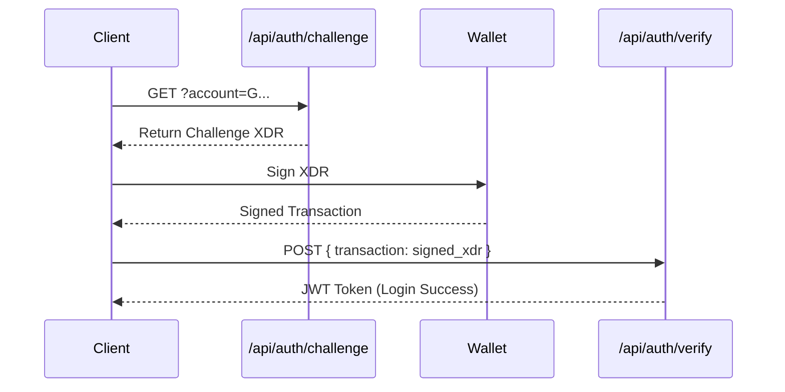

# GET /api/auth/challenge

The **`/api/auth/challenge`** route is the first step in the **SEP-10** (Stellar Web Authentication) flow. It issues a temporary, cryptographically secure challenge that the user must sign with their private key to prove ownership of a Stellar account.

## Overview

SEP-10 authentication is the standard for non-custodial login on Stellar. It allows users to authenticate with your dApp using any wallet (Freighter, Albedo, Rabe, etc.) without ever sharing their secret keys.

### Authentication Flow



---

## Request

| Method | Content-Type       | Response |
|--------|--------------------|----------|
| `GET`  | `application/json` | JSON     |

**Query Parameters:**

| Parameter | Type   | Required | Description |
|-----------|--------|----------|-------------|
| `account` | string | **Yes**  | The Stellar G-address requesting authentication. |

---

## Response

### Challenge Format
The response contains an unsigned transaction envelope (XDR). This transaction contains a `ManageData` operation with a cryptographically secure nonce.

```json
{
  "ok": true,
  "transaction": "AAAAAgAAA...",
  "network_passphrase": "Test SDF Network ; September 2015",
  "timeout": 300
}
```

| Field                | Type   | Description |
|----------------------|--------|-------------|
| `transaction`        | string | The base64-encoded transaction envelope (challenge). |
| `network_passphrase` | string | The passphrase for the network (Mainnet or Testnet). |
| `timeout`            | number | Expiry time for the challenge in seconds (default: 300). |

---

## Code Example: Full Authentication Flow

Integrating with the Stellar SDK and a browser wallet (e.g., Freighter).

```typescript
import { signTransaction } from "@stellar/freighter-api";

async function login(address: string) {
  // 1. Fetch Challenge
  const challengeRes = await fetch(`/api/auth/challenge?account=${address}`);
  const { transaction, network_passphrase } = await challengeRes.json();

  // 2. Sign with Wallet
  const signedXdr = await signTransaction(transaction, {
    network: network_passphrase === "Public Global Stellar Network ; October 2015" ? "PUBLIC" : "TESTNET"
  });

  // 3. Verify and Get JWT
  const verifyRes = await fetch('/api/auth/verify', {
    method: 'POST',
    body: JSON.stringify({ transaction: signedXdr })
  });

  const { token } = await verifyRes.json();
  localStorage.setItem('session_token', token);
}
```

---

## Security Considerations

> [!IMPORTANT]
> **Domain Binding:** The challenge transaction is tied to your dApp's domain. Wallets will verify this domain before prompting the user for a signature to prevent phishing.

- **Nonce Validation:** Every challenge contains a unique 48-byte random nonce to prevent replay attacks.
- **Timestamp Expiry:** Challenges are valid for a short window (64-bit Unix timestamps). If submitted after the `timeout`, they will be rejected by the `/api/auth/verify` route.
- **Server-Side Validation:** Nextellar's backend verifies that the signature matches the requested `account` and that the transaction hasn't been used before.

---

## See also

- [POST /api/auth/verify](/docs/routes-d/auth-verify) – The second step of SEP-10
- [useStellarWallet Hook](/docs/hooks/use-stellar-wallet) – Simplifies this entire logic into a single hook
- [SEP-10 Specification](https://github.com/stellar/stellar-protocol/blob/master/ecosystem/sep-0010.md) – Official protocol details
