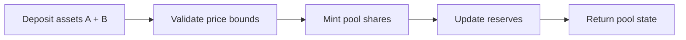

# /api/liquidity-pools

Documentation for the **`/api/liquidity-pools`** route that lists AMM pools and performs deposit, withdraw, and swap operations on Stellar's automated market maker (AMM).

## Overview

AMM pools hold two assets and follow the constant product formula `x * y = k`. Liquidity providers (LPs) deposit both assets to mint pool shares; swaps trade against pool reserves and pay a fee that accrues to LPs.

---

## GET: List pools by asset pair

**Endpoint:** `GET /api/liquidity-pools?asset_a=XLM&asset_b=USDC:GA5ZSE...ISSUER`

| Query param | Required | Description |
|------------|----------|-------------|
| `asset_a`  | Yes      | Base asset (`XLM` or `CODE:ISSUER`) |
| `asset_b`  | Yes      | Counter asset (`XLM` or `CODE:ISSUER`) |
| `network`  | No       | `testnet` or `public` (default: `testnet`) |

**Response (success):**

```json
{
  "ok": true,
  "pools": [
    {
      "poolId": "2ddf...b91",
      "reserves": {
        "assetA": { "code": "XLM", "amount": "8250.12" },
        "assetB": { "code": "USDC", "issuer": "GA5ZSE...ISSUER", "amount": "1025.45" }
      },
      "totalShares": "556.3001",
      "currentPrice": "0.1243",
      "feeBps": 30
    }
  ]
}
```

| Field          | Type   | Description |
|---------------|--------|-------------|
| `poolId`       | string | AMM pool ID (liquidity pool ID) |
| `reserves`     | object | Current reserves for each asset |
| `totalShares`  | string | Total outstanding pool shares |
| `currentPrice` | string | Price as `assetB/assetA` |
| `feeBps`       | number | Fee in basis points (e.g., `30` = 0.30%) |

---

## POST: Deposit liquidity

**Endpoint:** `POST /api/liquidity-pools`

| Method | Content-Type | Body |
|--------|--------------|------|
| `POST` | `application/json` | JSON (see below) |

**Request body (deposit):**

```json
{
  "operation": "deposit",
  "source": "GABC...SOURCE",
  "poolId": "2ddf...b91",
  "maxAmountA": "500.0",
  "maxAmountB": "75.0",
  "minPrice": "0.1200",
  "maxPrice": "0.1300",
  "network": "public"
}
```

| Field         | Type   | Required | Description |
|--------------|--------|----------|-------------|
| `operation`  | string | Yes      | Must be `deposit` |
| `source`     | string | Yes      | Source account providing liquidity |
| `poolId`     | string | Yes      | Target AMM pool ID |
| `maxAmountA` | string | Yes      | Max amount of asset A to deposit |
| `maxAmountB` | string | Yes      | Max amount of asset B to deposit |
| `minPrice`   | string | No       | Minimum acceptable `assetB/assetA` price |
| `maxPrice`   | string | No       | Maximum acceptable `assetB/assetA` price |
| `network`    | string | No       | `testnet` or `public` (default: `testnet`) |
| `memo`       | string | No       | Optional memo for the transaction |

**Response (success):**

```json
{
  "ok": true,
  "poolId": "2ddf...b91",
  "reserves": {
    "assetA": { "code": "XLM", "amount": "8750.12" },
    "assetB": { "code": "USDC", "issuer": "GA5ZSE...ISSUER", "amount": "1100.45" }
  },
  "totalShares": "589.9301",
  "currentPrice": "0.1257",
  "sharesMinted": "33.63"
}
```

---

## POST: Swap

**Endpoint:** `POST /api/liquidity-pools`

**Request body (swap):**

```json
{
  "operation": "swap",
  "source": "GABC...SOURCE",
  "poolId": "2ddf...b91",
  "sellAsset": { "code": "XLM" },
  "buyAsset": { "code": "USDC", "issuer": "GA5ZSE...ISSUER" },
  "sellAmount": "100.0",
  "minBuyAmount": "12.0",
  "network": "public"
}
```

| Field          | Type   | Required | Description |
|----------------|--------|----------|-------------|
| `operation`    | string | Yes      | Must be `swap` |
| `source`       | string | Yes      | Source account performing the swap |
| `poolId`       | string | Yes      | Target AMM pool ID |
| `sellAsset`    | object | Yes      | Asset being sold |
| `buyAsset`     | object | Yes      | Asset being bought |
| `sellAmount`   | string | Yes      | Amount of `sellAsset` to swap |
| `minBuyAmount` | string | No       | Slippage protection; minimum acceptable output |
| `network`      | string | No       | `testnet` or `public` (default: `testnet`) |
| `memo`         | string | No       | Optional memo for the transaction |

**Response (success):**

```json
{
  "ok": true,
  "poolId": "2ddf...b91",
  "reserves": {
    "assetA": { "code": "XLM", "amount": "8650.12" },
    "assetB": { "code": "USDC", "issuer": "GA5ZSE...ISSUER", "amount": "1112.85" }
  },
  "totalShares": "589.9301",
  "currentPrice": "0.1286",
  "amountOut": "12.40"
}
```

---

## DELETE: Withdraw liquidity

**Endpoint:** `DELETE /api/liquidity-pools`

**Request body (withdraw):**

```json
{
  "operation": "withdraw",
  "source": "GABC...SOURCE",
  "poolId": "2ddf...b91",
  "shares": "10.0",
  "minAmountA": "150.0",
  "minAmountB": "20.0",
  "network": "public"
}
```

| Field        | Type   | Required | Description |
|-------------|--------|----------|-------------|
| `operation` | string | Yes      | Must be `withdraw` |
| `source`    | string | Yes      | Source account withdrawing liquidity |
| `poolId`    | string | Yes      | Target AMM pool ID |
| `shares`    | string | Yes      | Pool shares to burn (full or partial) |
| `minAmountA`| string | No       | Minimum asset A to receive |
| `minAmountB`| string | No       | Minimum asset B to receive |
| `network`   | string | No       | `testnet` or `public` (default: `testnet`) |
| `memo`      | string | No       | Optional memo for the transaction |

**Response (success):**

```json
{
  "ok": true,
  "poolId": "2ddf...b91",
  "reserves": {
    "assetA": { "code": "XLM", "amount": "8500.12" },
    "assetB": { "code": "USDC", "issuer": "GA5ZSE...ISSUER", "amount": "1085.45" }
  },
  "totalShares": "579.9301",
  "currentPrice": "0.1276",
  "amountsOut": {
    "assetA": "150.0",
    "assetB": "20.0"
  }
}
```

---

## Diagram: Deposit flow



---

## Constant product formula

AMM pools keep the product of reserves roughly constant:

```
x * y = k
```

Swaps move along the curve by increasing one reserve and decreasing the other. Fees are added to the input side before the price impact is calculated.

---

## Fee structure

- Each swap charges a fee (e.g., `feeBps` basis points).
- Fees are added to the pool reserves.
- Because LP shares represent a pro-rata claim on reserves, fees accrue to LPs by increasing the value of each share over time.

---

## Swap output example

The following example estimates the swap output for an input amount using the constant product formula and a fee.

```typescript
const feeBps = 30; // 0.30%
const reserveIn = 8250.12;  // asset being sold
const reserveOut = 1025.45; // asset being bought
const amountIn = 100.0;

const feeMultiplier = 1 - feeBps / 10_000;
const amountInWithFee = amountIn * feeMultiplier;
const amountOut = (reserveOut * amountInWithFee) / (reserveIn + amountInWithFee);

console.log('Estimated output:', amountOut.toFixed(6));
```

---

## SDEX orderbook vs AMM liquidity pools

| Feature | SDEX Orderbook | AMM Liquidity Pool |
|---------|-----------------|--------------------|
| Pricing | Discrete bids/asks | Continuous curve (`x * y = k`) |
| Liquidity | From open offers | From pooled reserves |
| Execution | May partially fill | Always trades against pool (slippage applies) |
| Fees | Offer-based, paid by traders | Swap fee accrues to LPs |
| Best for | Tight spreads, low impact | Passive liquidity, always-available trades |

---

<Note type="warning">
Impermanent loss: if prices move significantly after you provide liquidity, the value of your LP position can be lower than simply holding the assets. This is a market risk and should be considered before depositing.
</Note>

---

## Error codes

| Code                  | HTTP Status | Description |
|-----------------------|-------------|-------------|
| `INVALID_ASSET`       | `400`       | Invalid or unsupported asset |
| `POOL_NOT_FOUND`      | `404`       | No pool exists for the given ID or asset pair |
| `INVALID_AMOUNT`      | `400`       | Amounts are missing or invalid |
| `PRICE_OUT_OF_BOUNDS` | `400`       | Deposit price bounds not satisfied |
| `INSUFFICIENT_FUNDS`  | `400`       | Source account has insufficient balance |
| `RATE_LIMITED`        | `429`       | Too many requests |
| `INTERNAL_ERROR`      | `500`       | Server error |
