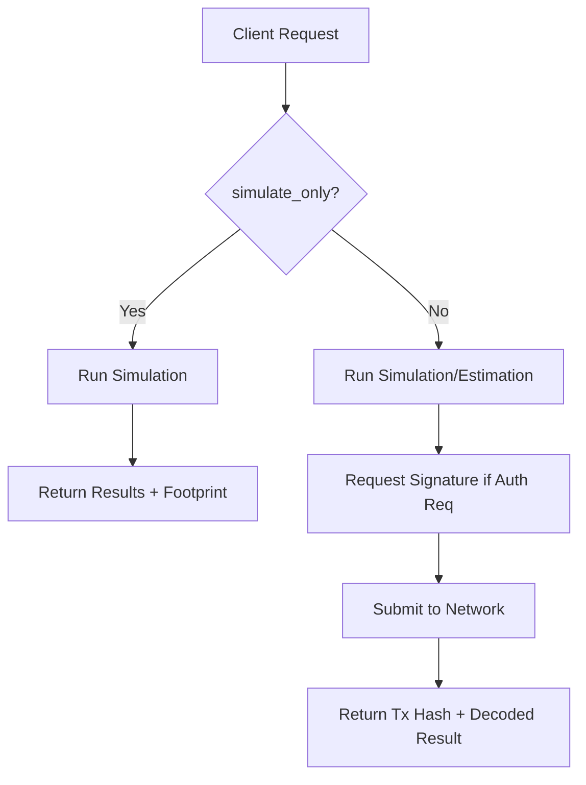

# POST /api/soroban/invoke

The **`/api/soroban/invoke`** endpoint is the primary interface for interacting with Soroban smart contracts. It abstracts away the complexity of XDR encoding/decoding, transaction building, and footprint estimation.

## Overview

This route supports two modes of operation:
1. **Simulation**: Runs the contract function in a read-only environment. Key for fetching state or estimating fees.
2. **Execution**: Builds, signs (if required by auth context), and submits a transaction to the network.

---

## Request

| Method | Content-Type       | Response |
|--------|--------------------|----------|
| `POST` | `application/json` | JSON     |

**Request Body Fields:**

| Field            | Type    | Required | Description |
|------------------|---------|----------|-------------|
| `contract_id`    | string  | **Yes**  | The 56-character Soroban contract ID (`C...`). |
| `function_name`  | string  | **Yes**  | The name of the export function to call. |
| `args`           | array   | No       | List of arguments. See [Type Mapping](#parameter-type-mapping). |
| `source_account` | string  | **Yes**  | Public key of the account paying for the transaction. |
| `simulate_only`  | boolean | No       | If `true`, the transaction is not submitted (default: `false`). |

---

## Technical Details

### Automatic XDR Encoding/Decoding
Nextellar automatically maps JSON types to Soroban ScVals. You do not need to manually construct XDR objects.
- **Inputs**: JSON arrays are converted to Soroban vectors/arguments.
- **Outputs**: The `result` field in the response is decoded from XDR back into a native JSON representation (e.g., Maps become Objects, Symbols become Strings).

### Execution Flow



---

## Response

### Response Schema

```typescript
interface InvokeResponse {
  ok: boolean;
  result: any; // Decoded JSON result
  transaction: {
    hash?: string;
    ledger?: number;
    status: 'SUCCESS' | 'FAILED' | 'SIMULATED';
  };
  resources: {
    cpu_ins: number;
    mem_bytes: number;
    ledger_reads: number;
    ledger_writes: number;
    fee_charged: string; // in XLM
  };
}
```

---

## Parameter Type Mapping

| Soroban Type | Rust Example | JSON Input |
|--------------|--------------|------------|
| `u32` / `i32` | `u32` | `number` |
| `u64` / `i64` | `i64` | `string` (or number if < 2^53) |
| `i128` / `u128`| `i128` | `string` (bigint numeric string) |
| `Symbol` | `Symbol::short("buy")` | `string` |
| `Address` | `Address` | `string` (G... or C...) |
| `Bytes` | `Bytes` | `string` (hex or base64) |
| `Vec<T>` | `Vec<u32>` | `Array<number>` |
| `Map<K, V>` | `Map<Symbol, i32>` | `Object` |

---

## Resource Limits & Fees
Every invocation calculates a "Resource Footprint". 
- **Read/Write Count**: Number of ledger entries touched.
- **CPU/RAM**: Computational resources consumed.
- **Inclusion Fee**: Minimum fee + network surge pricing.

The API automatically attaches the required footprint and suggested fee based on the initial simulation.

---

## Code Example: Token Transfer

Invoking a standard Soroban Token (SEP-41) `transfer` function.

```typescript
const payload = {
  contract_id: 'CAS3J7...TOKEN',
  function_name: 'transfer',
  args: [
    'GSOURCE...', // from
    'GDEST...',   // to
    '1000000000'  // amount (as string for i128)
  ],
  source_account: 'GSOURCE...',
  simulate_only: false
};

const res = await fetch('/api/soroban/invoke', {
  method: 'POST',
  body: JSON.stringify(payload)
});

const { result, transaction, resources } = await res.json();

console.log(`Transferred! Fee: ${resources.fee_charged} XLM`);
console.log(`TX Hash: ${transaction.hash}`);
```

---

## Error Handling

| Error Code | HTTP | Description |
|------------|------|-------------|
| `CONTRACT_PANIC` | `400` | The contract crashed (e.g., `panic!`, `assert!`). Look at `error.debug_events`. |
| `AUTH_REQUIRED` | `401` | The function requires a signature that wasn't provided or is invalid. |
| `RESOURCE_EXHAUSTED` | `400` | Call exceeded network limits for CPU, RAM, or IO. |
| `INSUFFICIENT_FUNDS` | `402` | `source_account` cannot cover the transaction fee. |

---

## See also

- [Soroban Events API](/docs/routes-d/soroban-events) - Stream contract events
- [Stellar RPC Guide](https://developers.stellar.org/docs/data/rpc) - Underlying infrastructure
- [useSorobanContract](/docs/hooks/use-soroban-contract) - React implementation
