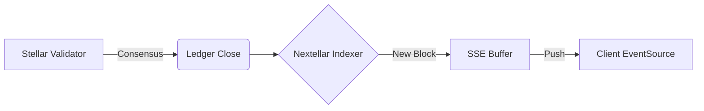

# GET /api/stream/ledgers

The **`/api/stream/ledgers`** route provides a persistent Server-Sent Events (SSE) connection that pushes block-by-block network updates as soon as they are validated by the Stellar network.

## Overview

Stellar ledgers close approximately every **5 seconds**. This stream allows developers to build low-latency dashboards, track transaction confirmations, or trigger backend workflows without polling Horizon.

### Key Use Cases
- **Network Monitoring**: Visualize global TPS and ledger capacity.
- **Tx Confirmation**: Track when a specific transaction is included in a closed ledger.
- **Data Indexing**: Maintain a local cache of the network state.

---

## Connection Specification

| Method | Content-Type        | Protocol |
|--------|---------------------|----------|
| `GET`  | `text/event-stream` | SSE      |

**Query Parameters:**

| Parameter | Type   | Required | Description |
|-----------|--------|----------|-------------|
| `cursor`  | string | No       | Start streaming from a specific ledger sequence. If omitted, starts from the latest ledger. |

---

## Event Payload

Each event emitted by the stream is a JSON object containing the ledger's metadata.

```json
{
  "sequence": 56213401,
  "hash": "7a2e3f...",
  "closed_at": "2026-02-25T22:50:00Z",
  "transaction_count": 42,
  "operation_count": 128,
  "base_fee": 100,
  "protocol_version": 21
}
```

| Field               | Type   | Description |
|---------------------|--------|-------------|
| `sequence`          | number | The ledger sequence number. |
| `hash`              | string | SHA-256 hash of the ledger header. |
| `closed_at`         | string | ISO 8601 timestamp of ledger close. |
| `transaction_count` | number | Total number of transactions in this block. |
| `operation_count`   | number | Total number of operations across all transactions. |
| `base_fee`          | number | The base fee (in stroops) for this ledger. |

---

## Emission Pipeline



---

## Implementation Examples

### Vanilla JavaScript

```javascript
const streamUrl = '/api/stream/ledgers?cursor=now';
const eventSource = new EventSource(streamUrl);

eventSource.onmessage = (event) => {
  const ledger = JSON.parse(event.data);
  console.log(`New Ledger: ${ledger.sequence} with ${ledger.transaction_count} txs`);
};

eventSource.onerror = (err) => {
  console.error("SSE Connection failed. Reconnecting...", err);
  // Browser automatically attempts reconnection for SSE
};
```

### React Hook Example

```typescript
import { useState, useEffect } from 'react';

export function useLedgerStream(initialCursor = 'now') {
  const [latestLedger, setLatestLedger] = useState(null);
  const [error, setError] = useState(null);

  useEffect(() => {
    const es = new EventSource(`/api/stream/ledgers?cursor=${initialCursor}`);

    es.onmessage = (e) => setLatestLedger(JSON.parse(e.data));
    es.onerror = (e) => setError(e);

    return () => es.close(); // Important: Cleanup on unmount
  }, [initialCursor]);

  return { latestLedger, error };
}
```

---

## Operational Notes

### Persistence & Reconnection
- **Automatic Retries**: Standard browser `EventSource` implementations automatically handle reconnection if the socket drops.
- **Cursor Management**: To avoid missing ledgers during a disconnect, always store the last received `sequence` and use it as the `?cursor=` parameter when manually re-initializing.

### Memory & Performance
- **Connection Limits**: Browsers typically limit SSE to 6 concurrent connections per domain. Keep this in mind for multi-tab applications.
- **Data Volume**: At ~5s intervals, the memory overhead is minimal. However, avoid heavy DOM manipulation on every event to prevent UI stutter.

---

## See also

- [Streaming Payments](/docs/routes-d/stream-payments) - Stream specific payment operations
- [Stellar Ledger Docs](https://developers.stellar.org/docs/glossary/ledger) - Deep dive into ledger structure
