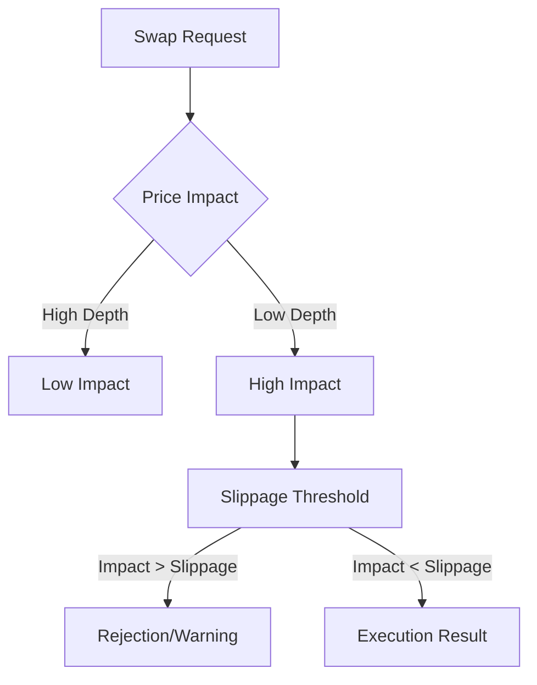

# GET /api/swap/quote

The **`/api/swap/quote`** route provides real-time pricing for token swaps on the Stellar network. It automatically finds the best path by aggregating liquidity across the **Stellar Decentralized Exchange (DEX)** orderbooks and **Automated Market Maker (AMM)** liquidity pools.

## Overview

Swapping on Stellar can involve multiple paths and liquidity sources. This endpoint simplifies the process by returning a guaranteed quote (valid for 30 seconds) that includes fee calculations and price impact analysis.

---

## Request

| Method | Content-Type       | Response |
|--------|--------------------|----------|
| `GET`  | `application/json` | JSON     |

**Query Parameters:**

| Parameter  | Type   | Required | Default | Description |
|------------|--------|----------|---------|-------------|
| `from`     | string | **Yes**  | -       | Source asset (`XLM` or `CODE:ISSUER`). |
| `to`       | string | **Yes**  | -       | Destination asset (`XLM` or `CODE:ISSUER`). |
| `amount`   | string | **Yes**  | -       | Amount of the `from` asset to swap. |
| `slippage` | number | No       | `0.5`   | Maximum allowed price deviance as a percentage. |

---

## Response

### Quote Schema

```typescript
interface SwapQuoteResponse {
  ok: boolean;
  quote: {
    from_asset: string;
    to_asset: string;
    source_amount: string;
    expected_amount: string; // Amount user will likely receive
    min_amount: string;      // Guaranteed minimum (after slippage)
    price_impact: number;    // Percentage drop due to depth
    route: 'DEX' | 'AMM' | 'AGGREGATED';
    path: string[];          // Hop-by-hop asset path
    expires_at: string;      // ISO 8601 timestamp
  };
}
```

> [!WARNING]
> **Quote Expiry:** Quotes are highly sensitive to network state changes. All quotes expire **30 seconds** after emission. Submitting a transaction with an expired quote may result in a `TX_TOO_LATE` error.

---

## Price Impact vs. Slippage

It is important to distinguish between how the market looks (Impact) and what you are willing to tolerate (Slippage).



- **Price Impact**: The estimated change in price caused specifically by the size of your trade relative to the available liquidity.
- **Slippage Tolerance**: A buffer for price movements that occur *between* the moment you request a quote and the moment the transaction is validated on the ledger.

---

## Interactive Preview

Nextellar components use this route to provide a "What you see is what you get" experience.

<Tabs items={['Swap Component', 'Quote JSON']}>
  <Tab value="Swap Component">
    | Component | Value |
    |-----------|-------|
    | **Pay** | 1000 XLM |
    | **Receive** | ~120.50 USDC |
    | **Impact** | 0.05% (Excellent) |
    | **Min. Received** | 119.89 USDC |
  </Tab>
  <Tab value="Quote JSON">
    ```json
    {
      "ok": true,
      "quote": {
        "from_asset": "XLM",
        "to_asset": "USDC:GA5Z...",
        "source_amount": "1000.0000000",
        "expected_amount": "120.5032100",
        "min_amount": "119.8943200",
        "price_impact": 0.05,
        "route": "AGGREGATED"
      }
    }
    ```
  </Tab>
</Tabs>

---

## Code Example: Get & Execute

A typical frontend flow for executing a swap after user confirmation.

```typescript
async function performSwap() {
  // 1. Fetch Quote
  const params = new URLSearchParams({
    from: 'XLM',
    to: 'USDC:GA5Z...',
    amount: '1000',
    slippage: '0.5'
  });
  
  const res = await fetch(`/api/swap/quote?${params}`);
  const { quote } = await res.json();

  // 2. User Confirmation UI
  const confirmed = await showSwapModal(quote);
  if (!confirmed) return;

  // 3. Check Expiry
  if (new Date(quote.expires_at) < new Date()) {
    throw new Error("Quote expired. Please refresh.");
  }

  // 4. Execute (submits to transaction-submit route)
  await executeSwap(quote);
}
```

---

## See also

- [Transaction Submission](/docs/routes-d/transaction-submit) – Finalize the swap
- [Liquidity Pools](/docs/routes-d/liquidity-pools) – Deep dive into AMM mechanics
- [Path Payment Discovery](/docs/routes-d/path-payment-find) – Underlying protocol operation
