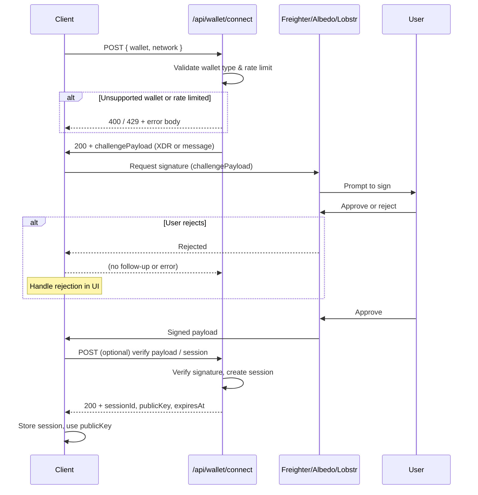

# POST /api/wallet/connect

Documentation for the **`/api/wallet/connect`** route that handles wallet connection handshakes for Freighter, Albedo, and Lobstr wallets.

## Overview

This endpoint initiates and completes the wallet connection handshake. The client sends wallet type and optional challenge data; the server validates the request, may return a signable payload, and on success returns session and public key information.

---

## Request / Response Schema

### Request

| Method | Content-Type   | Body |
|--------|----------------|------|
| `POST` | `application/json` | JSON (see below) |

**Request body (JSON):**

```json
{
  "wallet": "freighter",
  "network": "testnet",
  "challengeId": "optional-nonce-for-replay-protection"
}
```

| Field         | Type   | Required | Description |
|--------------|--------|----------|-------------|
| `wallet`     | string | Yes      | One of `freighter`, `albedo`, `lobstr` |
| `network`    | string | No       | `testnet` or `public` (default: `testnet`) |
| `challengeId`| string | No       | Client-generated nonce for replay protection |

### Response (success)

**Status:** `200 OK`

```json
{
  "ok": true,
  "sessionId": "sess_abc123xyz",
  "publicKey": "GABC...XYZ",
  "wallet": "freighter",
  "network": "testnet",
  "expiresAt": "2025-02-24T12:00:00Z"
}
```

| Field       | Type   | Description |
|------------|--------|-------------|
| `ok`       | boolean | Always `true` on success |
| `sessionId`| string | Server-issued session identifier |
| `publicKey`| string | Stellar public key (G...) from the wallet |
| `wallet`   | string | Echo of the connected wallet type |
| `network`  | string | Echo of the network |
| `expiresAt`| string | ISO 8601 session expiry time |

### Response (error)

**Status:** `4xx` or `5xx` (see [Error codes](#error-codes-and-edge-cases))

```json
{
  "ok": false,
  "error": {
    "code": "SESSION_EXPIRED",
    "message": "Wallet session has expired. Please reconnect."
  }
}
```

---

## Authentication flow (sequence diagram)

The following Mermaid diagram describes the handshake flow between client, API, and wallet.



---

## Code examples

### Success: connect and use session

```typescript
const response = await fetch('/api/wallet/connect', {
  method: 'POST',
  headers: { 'Content-Type': 'application/json' },
  body: JSON.stringify({
    wallet: 'freighter',
    network: 'testnet',
  }),
});

if (!response.ok) {
  throw new Error(`Connect failed: ${response.status}`);
}

const data = await response.json();
if (!data.ok || !data.sessionId) {
  throw new Error(data.error?.message ?? 'Invalid response');
}

// Use session and public key
console.log('Connected:', data.publicKey);
console.log('Session:', data.sessionId);
console.log('Expires:', data.expiresAt);
localStorage.setItem('wallet_session', data.sessionId);
localStorage.setItem('wallet_public_key', data.publicKey);
```

### Error: handle expired session and rejected signature

```typescript
async function connectWallet() {
  const res = await fetch('/api/wallet/connect', {
    method: 'POST',
    headers: { 'Content-Type': 'application/json' },
    body: JSON.stringify({ wallet: 'albedo', network: 'testnet' }),
  });

  const data = await res.json();

  if (data.ok) {
    return data;
  }

  const { code, message } = data.error || {};

  switch (code) {
    case 'SESSION_EXPIRED':
      // Clear stored session and prompt reconnection
      localStorage.removeItem('wallet_session');
      throw new Error('Session expired. Please connect again.');
    case 'SIGNATURE_REJECTED':
      throw new Error('You rejected the signature request.');
    case 'UNSUPPORTED_WALLET':
      throw new Error('This wallet is not supported. Use Freighter, Albedo, or Lobstr.');
    case 'RATE_LIMITED':
      throw new Error('Too many attempts. Please try again later.');
    default:
      throw new Error(message || 'Wallet connection failed');
  }
}
```

---

## Error codes and edge cases

| Code                 | HTTP Status | Description |
|----------------------|-------------|-------------|
| `UNSUPPORTED_WALLET` | `400`       | `wallet` is not `freighter`, `albedo`, or `lobstr`. |
| `INVALID_PAYLOAD`    | `400`       | Missing `wallet`, invalid JSON, or invalid `network`. |
| `SESSION_EXPIRED`   | `401`       | Previously issued session has expired; client must reconnect. |
| `SIGNATURE_REJECTED`| `403`       | User rejected the signing request in the wallet. |
| `RATE_LIMITED`      | `429`       | Too many connection attempts (see [Rate limiting](#rate-limiting-behavior)). |
| `INTERNAL_ERROR`    | `500`       | Server or wallet adapter error; retry or report. |

### Edge cases

- **Expired session:** Any subsequent request using an expired `sessionId` returns `401` with `SESSION_EXPIRED`. Clear local session state and call `/api/wallet/connect` again.
- **Rejected signature:** If the user closes the wallet popup or clicks "Reject", the API may return `403` with `SIGNATURE_REJECTED`. No session is created.
- **Unsupported wallet:** Sending a wallet type not in the allowlist (e.g. `xbull`) returns `400` with `UNSUPPORTED_WALLET`. Only Freighter, Albedo, and Lobstr are supported by this route.

---

## Rate limiting behavior

- **Scope:** Per IP and optionally per wallet identifier.
- **Limit:** A common default is **10 requests per minute** for `/api/wallet/connect`; exact values depend on deployment configuration.
- **Response:** When exceeded, the API returns **`429 Too Many Requests`** with body `{ "ok": false, "error": { "code": "RATE_LIMITED", "message": "..." } }`.
- **Headers:** Responses may include `Retry-After` (seconds) and `X-RateLimit-*` headers when applicable.
- **Recommendation:** Implement exponential backoff and surface a clear "Try again later" message to the user.

---

## See also

- [Wallets (Freighter, Albedo, Lobstr)](/docs/integrations/wallets) – Client-side wallet integration
- [WalletConnect](/docs/integrations/walletconnect) – Connect wallet UI and provider
- [API Reference](/docs/sdk/api-reference) – SDK and wallet API overview
