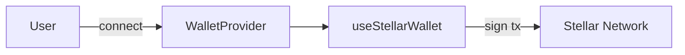
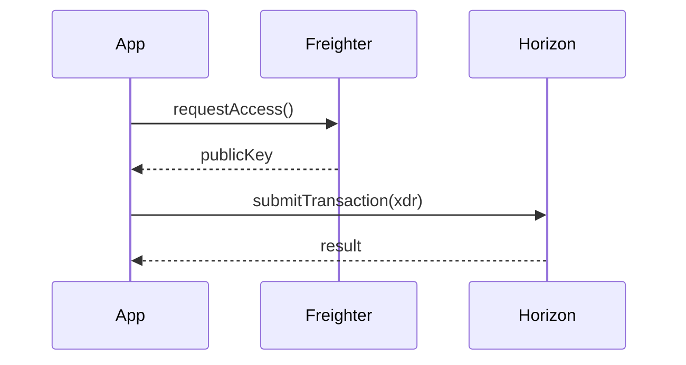

# Issue #210 — Write a guide on adding diagrams with Mermaid

Working draft for the docs change requested in issue #210.

## Planned doc location

- `docs/guides/mermaid-diagrams.mdx`

## Scope

- Show how to embed Mermaid diagrams in MDX pages
- Cover the most useful diagram types for a docs site (flowchart, sequence)
- Include a working code example

## Draft content

```mdx
---
title: Adding Diagrams with Mermaid
description: Embed interactive diagrams in your Nextellar docs using Mermaid
---

# Adding Diagrams with Mermaid

Nextellar docs supports [Mermaid](https://mermaid.js.org/) diagrams out of the box.
Wrap your diagram code in a fenced code block tagged `mermaid`:

````md

````

### Rendered result


## Sequence diagrams



## Tips

- Keep diagrams narrow — very wide diagrams overflow on mobile.
- Use `LR` (left-to-right) for flow diagrams and `TD` (top-down) for hierarchies.
- Mermaid is rendered client-side; diagrams won't appear in RSS feeds or plain markdown exports.
```

## Notes

- Confirm Mermaid is already wired into the MDX pipeline before merging.
  Check `next.config.*` or the rehype plugins for `rehype-mermaid` / `remark-mermaidjs`.
- If not wired, the setup steps should be added to the guide.
