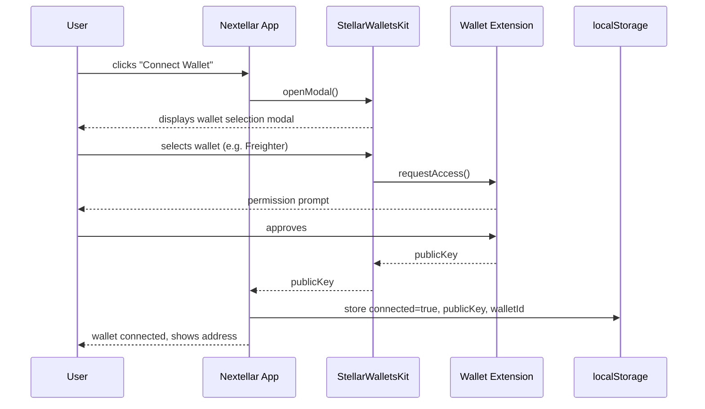
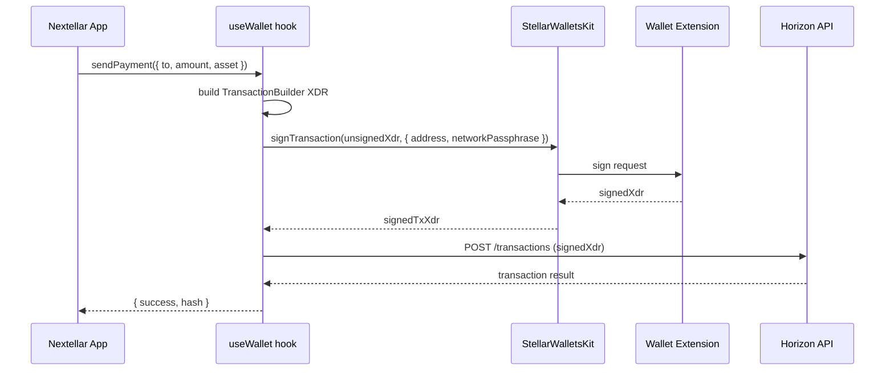
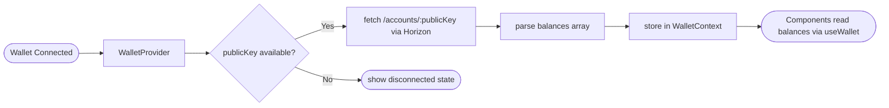
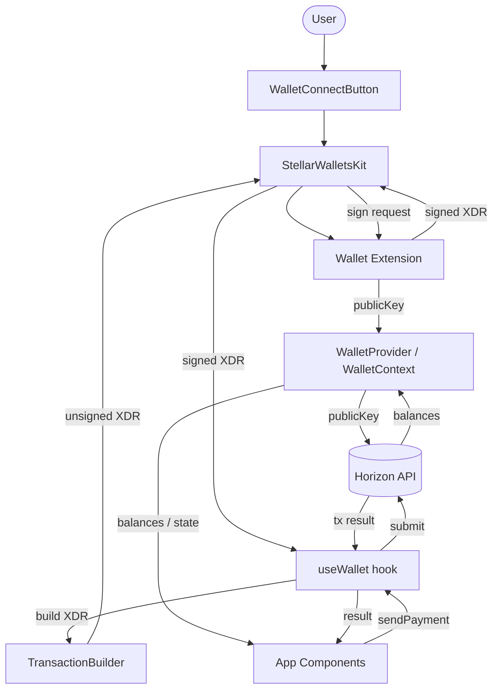
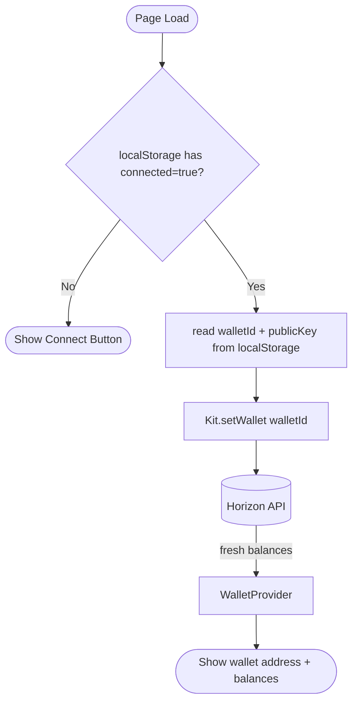

# Data Flow Diagrams

This page shows the main data paths in a Nextellar application using Mermaid diagrams. Each diagram covers a distinct flow: wallet connection, transaction signing, balance fetching, and the full end-to-end payment path.

---

## 1. Wallet connection flow

When a user clicks "Connect Wallet," the following sequence takes place between the browser, the Stellar Wallets Kit, the chosen wallet extension, and the Nextellar provider.



_Caption: The wallet connection sequence. The app never sees the private key — only the public key is returned._

---

## 2. Transaction signing and submission flow

Signing a transaction requires the wallet extension to approve it before it is submitted to the Stellar network via Horizon.



_Caption: Transaction signing stays inside the wallet extension. The app only passes the unsigned XDR and receives the signed XDR back._

---

## 3. Balance fetching flow

Balances are fetched from Horizon after connection and refreshed on demand.



_Caption: Balance fetching is triggered automatically on connection and when `refreshBalances()` is called._

---

## 4. Full end-to-end data flow

This diagram combines all major paths: wallet connection, balance fetch, transaction build, sign, and submit.



_Caption: Full end-to-end data flow. `WalletProvider` is the central state hub; Horizon is the only network endpoint the app talks to directly._

---

## 5. Session restore flow

On page reload, the provider checks localStorage for an existing session before prompting the user again.



_Caption: Auto-reconnect on page load avoids asking users to connect every time they visit._

---

## Diagram style notes

- All diagrams use [Mermaid](https://mermaid.js.org/) and render in the Nextellar docs pipeline via the configured rehype plugin.
- Use `sequenceDiagram` for time-ordered interactions between named actors.
- Use `flowchart LR` (left-to-right) or `flowchart TD` (top-down) for data and state flows.
- Keep node labels short; add a _Caption_ line below each diagram for context.

See [Diagram and Image Style Guide](/docs/guides/diagram-image-style) for visual conventions.

---

## Validate your changes

```bash
pnpm build:content
pnpm check:links
```

---

## Related documentation

- [Wallet Integration](/docs/integrations/wallets) — wallet module setup and configuration
- [Horizon Integration](/docs/integrations/horizon) — Horizon REST API usage
- [useStellarWallet](/docs/hooks/use-stellar-wallet) — standalone wallet hook reference
- [Diagram and Image Style Guide](/docs/guides/diagram-image-style) — style rules for diagrams
